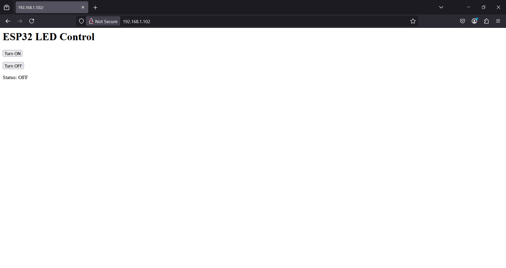
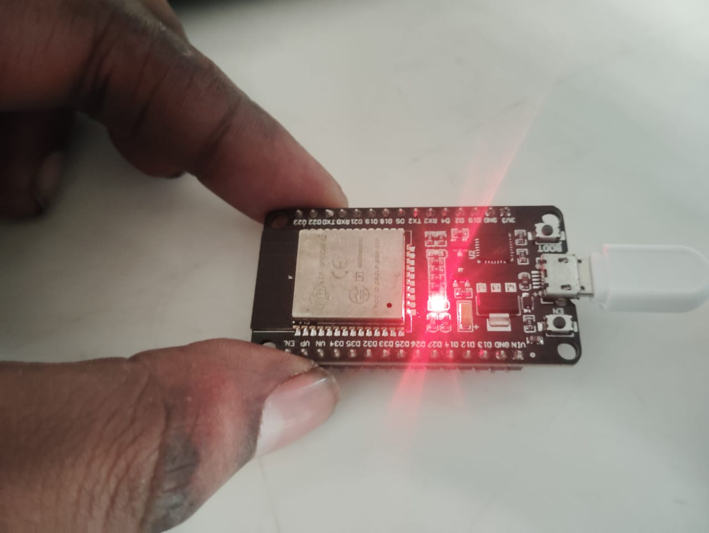
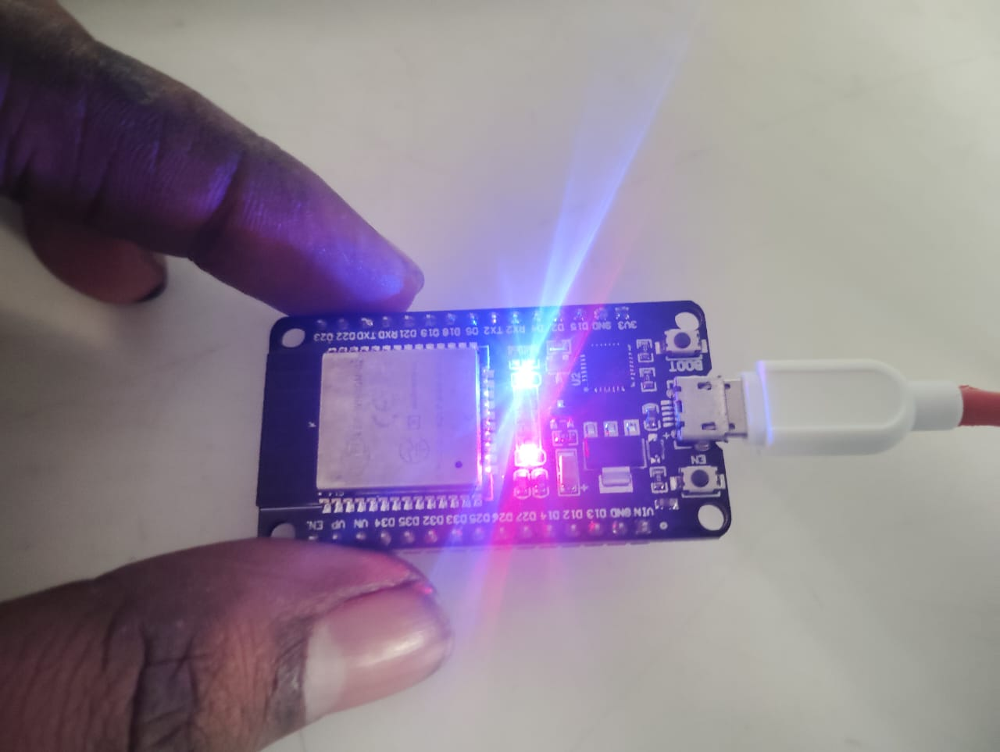

Perfect! You're almost there — now let's extend your web page so it includes **ON/OFF buttons** that control the **built-in LED** (usually on GPIO 2 for most ESP32 boards).

---

### ✅ Full Working Code: LED Control with ON/OFF Buttons

```cpp
#include <WiFi.h>
#include <WebServer.h>

const char* ssid = "YOUR_SSID";
const char* password = "YOUR_PASSWORD";

WebServer server(80);
const int ledPin = 2;  // Built-in LED pin on ESP32

void handleRoot() {
  String html = "<h1>ESP32 LED Control</h1>";
  html += "<p><a href=\"/on\"><button>Turn ON</button></a></p>";
  html += "<p><a href=\"/off\"><button>Turn OFF</button></a></p>";
  html += "<p>Status: ";
  html += digitalRead(ledPin) ? "ON" : "OFF";
  html += "</p>";

  server.send(200, "text/html", html);
}

void handleOn() {
  digitalWrite(ledPin, HIGH);
  server.sendHeader("Location", "/");  // Redirect to home page
  server.send(303);
}

void handleOff() {
  digitalWrite(ledPin, LOW);
  server.sendHeader("Location", "/");  // Redirect to home page
  server.send(303);
}

void setup() {
  Serial.begin(115200);
  delay(2000);
  for (int i = 0; i < 20; i++) Serial.println();

  pinMode(ledPin, OUTPUT);
  digitalWrite(ledPin, LOW);  // Start with LED off

  WiFi.begin(ssid, password);
  Serial.print("Connecting to WiFi");

  while (WiFi.status() != WL_CONNECTED) {
    delay(500);
    Serial.print(".");
  }

  Serial.println("\nConnected to WiFi!");
  Serial.print("IP Address: ");
  Serial.println(WiFi.localIP());

  server.on("/", handleRoot);
  server.on("/on", handleOn);
  server.on("/off", handleOff);
  
  server.begin();
  Serial.println("Web server started!");
}

void loop() {
  server.handleClient();
}
```

---

### 🧪 How It Works:

- Visiting `/` shows two buttons: **Turn ON** and **Turn OFF**
- Clicking a button triggers `/on` or `/off`, which toggles the **inbuilt LED**
- After toggling, you're redirected back to the main page with the LED status

---

### ✅ Output Sample

In your browser at `http://<your-ESP32-IP>` you'll see:

```
ESP32 LED Control
[Turn ON]  [Turn OFF]
Status: OFF
```

---

Want to make it **responsive mobile-friendly**, or build an **AJAX auto-refresh UI**? I can help upgrade it too!





