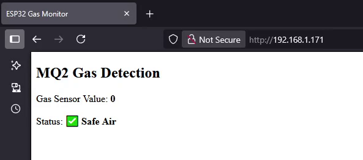
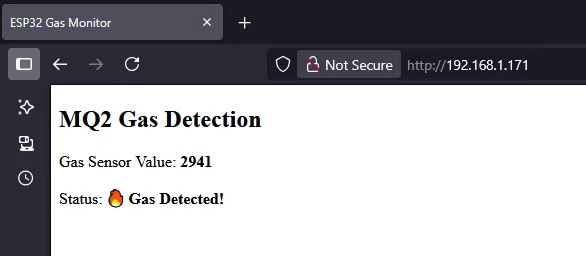

You got it! Let’s enhance your MQ2 gas detection sketch by adding a **web server** that shows **live gas status**: either ✅ *Safe Air* or 🔥 *Gas Detected!* — plus the sensor value.

---

### ✅ Full Code: MQ2 + Buzzer + Web Server + Live Status

```cpp
#include <WiFi.h>
#include <WebServer.h>

// WiFi credentials
const char* ssid = "SRI_ABIRAMI_PAPER";
const char* password = "12345678";

// Pin Definitions
#define MQ2_PIN 34
#define BUZZER_PIN 27
#define LED_BUILTIN 2
#define THRESHOLD 150
#define WARMUP_TIME 120  // reduce for testing

WebServer server(80);

String gasStatus = "Warming up...";
int gasValue = 0;

// HTML Page
String getHTMLPage() {
  String html = "<html><head><title>ESP32 Gas Monitor</title></head><body>";
  html += "<meta charset='UTF-8'>";
  html += "<h2>MQ2 Gas Detection</h2>";
  html += "<p>Gas Sensor Value: <strong>" + String(gasValue) + "</strong></p>";
  html += "<p>Status: <strong>" + gasStatus + "</strong></p>";
  html += "</body></html>";
  return html;
}

void handleRoot() {
  server.send(200, "text/html", getHTMLPage());
}

void setup() {
  Serial.begin(115200);
  pinMode(MQ2_PIN, INPUT);
  pinMode(BUZZER_PIN, OUTPUT);
  pinMode(LED_BUILTIN, OUTPUT);

  Serial.println("MQ2 Sensor Warming Up...");

  // Warm-up countdown
  for (int i = WARMUP_TIME; i > 0; i--) {
    Serial.print("Warming up: ");
    Serial.print(i);
    Serial.println("s remaining");
    delay(1000);
  }

  Serial.println("✅ Sensor Warmed Up. Starting Gas Detection...");

  WiFi.begin(ssid, password);
  Serial.print("Connecting to WiFi");
  while (WiFi.status() != WL_CONNECTED) {
    delay(500);
    Serial.print(".");
  }

  Serial.println("\nWiFi Connected!");
  Serial.print("ESP32 IP Address: ");
  Serial.println(WiFi.localIP());

  server.on("/", handleRoot);
  server.begin();
  Serial.println("Web server started!");
}

void loop() {
  gasValue = analogRead(MQ2_PIN);
  Serial.print("Gas Sensor Value: ");
  Serial.println(gasValue);

  if (gasValue > THRESHOLD) {
    gasStatus = "🔥 Gas Detected!";
    digitalWrite(BUZZER_PIN, HIGH);
    digitalWrite(LED_BUILTIN, LOW);
  } else {
    gasStatus = "✅ Safe Air";
    digitalWrite(BUZZER_PIN, LOW);
    digitalWrite(LED_BUILTIN, HIGH);
  }

  server.handleClient();
  delay(1000);
}
```

---

### 🌐 What You’ll See in the Browser

Visit: `http://<ESP32-IP>`  
Example:

```
Gas Sensor Value: 123
Status: ✅ Safe Air
```

or

```
Gas Sensor Value: 312
Status: 🔥 Gas Detected!
```

---

### 🧠 Optional Enhancements

- 🔄 Add auto-refresh every 2 seconds:
  ```html
  <head>
    <meta http-equiv='refresh' content='2'>
  </head>
  ```
- 📈 Show a chart of sensor values using JavaScript.
- 📱 Make it mobile-friendly with CSS.

Want help adding any of those features next?


