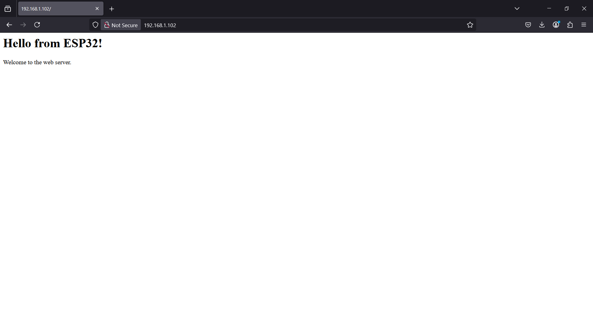

Awesome — since your **ESP32 is connected to Wi-Fi**, you're ready to **host a web page** on it! This means you can visit your ESP32’s **IP address in your browser** (on the same Wi-Fi network) and see a page it serves.

---

## 🧑‍💻 Step-by-Step: ESP32 Web Server Example

### ✅ 1. Upload This Code:

```cpp
#include <WiFi.h>
#include <WebServer.h>

const char* ssid = "YOUR_SSID";
const char* password = "YOUR_PASSWORD";

// Create a web server on port 80
WebServer server(80);

void handleRoot() {
  server.send(200, "text/html", "<h1>Hello from ESP32!</h1><p>Welcome to the web server.</p>");
}

void setup() {
  Serial.begin(115200);
 
  delay(2000);  // <-- Let the serial port settle

  // Clear screen
  for (int i = 0; i < 20; i++) Serial.println();
  
  WiFi.begin(ssid, password);
  Serial.print("Connecting to WiFi");

  while (WiFi.status() != WL_CONNECTED) {
    delay(500);
    Serial.print(".");
  }

  Serial.println("\nConnected to WiFi!");
  Serial.print("IP Address: ");
  Serial.println(WiFi.localIP());

  server.on("/", handleRoot);   // When "/" is accessed
  server.begin();               // Start the web server
  Serial.println("Web server started!");
}

void loop() {
  server.handleClient(); // Handle incoming clients
}
```

---

### ✅ 2. Open Serial Monitor

- Set baud to `115200`
- You'll see output like:

```
Connected to WiFi!
IP Address: 192.168.1.42
Web server started!
```

---

### ✅ 3. Open Browser

- Go to your browser (on a device connected to the same Wi-Fi).
- Enter the IP address printed in Serial Monitor, e.g.:

```
http://192.168.1.42
```

---

### ✅ 4. See the Web Page!

You should see:

```
Hello from ESP32!
Welcome to the web server.
```

---

### 🧪 Tip: Customize HTML Page

Change this line to your own custom page:

```cpp
server.send(200, "text/html", "<h1>Hello!</h1>");
```

You can embed:
- Buttons
- Forms
- JavaScript
- CSS

Want a web page that **controls GPIO (LEDs, relays)** or sends **sensor data live**? I can help you with that next!


